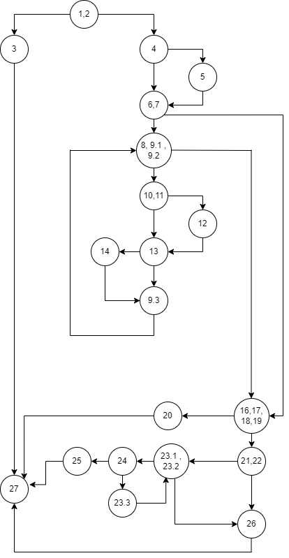
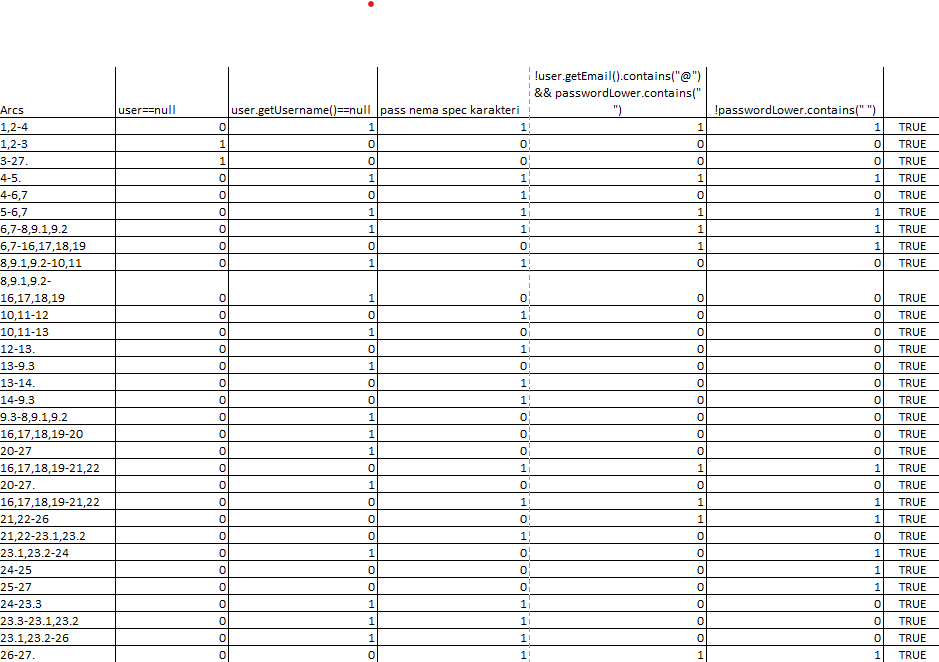

# SI_2023_lab2_213080
# Марија Ефтимова 213080
## 2.За дадениот код во функцијата function нацртајте Control Flow Graph со некоја алатка за цртање дијаграми. Внесете го нацртанот CFG во документацијата.

## 3.Пресметајте ја цикломатската комплексност на дадениот код. Објаснете како стигнавте до резултатот.
### Број на ребра - број на јазли + 2
### Број на ребра =29
### Број на јазли= 20 
### 29-20+2= 11  
### Цикломатската комплексност на дадениот код е 11.
## 4.Напишете ги сите тест случаи според Every Branch критериумот. Напишете и објаснете ги тест случаите во документацијата.
 
